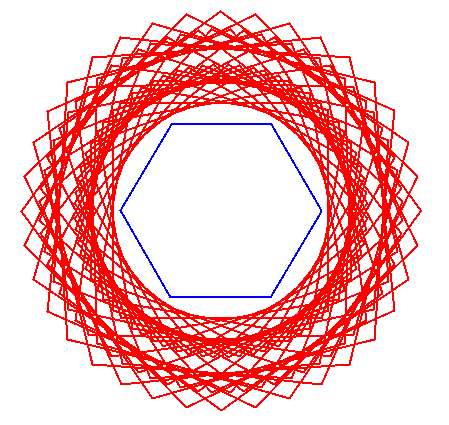

# TD3: Lexical and Syntaxical Analysis (Mini-Turtle parser in Java)

The goal of this lab is to implement the parsing of a small Logo language (graphical turtle) whose interpreter is provided. No prior knowledge of Logo is required. Parsing is implemented using the tools JFlex and CUP. JFlex is already installed in the lab rooms. CUP is contained in the tarball that is provided.



The basic structure is provided (a tarball with Java files and a Makefile) : mini-turtle-java.tar.gz. Once uncompressed (for instance with tar zxvf mini-turtle-java.tar.gz), you get a directory mini-turtle-java/. (If you use Eclipse, run it in the directory containing mini-turtle-java/ with eclipse -data . then create a project mini-turtle-java and disable option Use default location.) This project contains a package mini_turtle with the following files:

- **Turtle.java** the graphical turtle (complete)
- **Syntax.java** abstract syntax of mini-Turtle (complete)
- **Lexer.flex** lexical analyzer (*to be completed in this TD!*)
- **Parser.cup** syntax analyzer (*to be completed in this TD!*)
- **Interp.java** interpreter (complete)
- **Main.java** main file (complete)
- **Makefile** to automate the build (complete)

The code compiles but is incomplete. The command make recompiles everything (including calls to JFlex and CUP) and runs the program on a test file.

The program takes a file to be interpreted on the command line, with suffix .logo. When it is not provided, it defaults to test.logo.

## Syntax of mini-Turtle

### Lexical conventions

Spaces, tabs, and newlines are blanks. There are two kinds of comments: from // to the end of the line, or enclosed by (* and *) (and not nested). The following identifiers are keywords:

```
if else def repeat penup pendown forward turnleft
turnright color black white red green blue
```

An identifier *ident* contains letters, digits, and underscores and starts with a letter. An integer literal *integer* is a sequence of digits.

### Syntax

Names in italics, such as expr, are nonterminals. Notation stmt* means a repetition zero, one, or several times of nonterminal stmt. Notation expr*, means a repetition of nonterminal expr where occurrences are separated with the terminal , (a comma).

```
  file ::= def* stmt*
  def  ::= def ident ( ident*, ) stmt
  stmt ::= penup
         | pendown
         | forward expr
         | turnleft expr
         | turnright expr
         | color color
         | ident ( expr*, )
         | if expr stmt
         | if expr stmt else stmt
         | repeat expr stmt
         | { stmt* }
  expr ::= integer
         | ident
         | expr + expr
         | expr - expr
         | expr * expr
         | expr / expr
         | - expr
         | ( expr )
 color ::= black | white | red | green | blue
```

Priorities of arithmetic operations are usual, and unary negation has the strongest priority.

## Lab assignment

You have to fill files **Lexer.flex (JFlex)** and **Parser.cup (CUP)**. The following questions suggest an incremental way of doing this. At each step, you can test by modifying file test.logo. The command make (at the root of the directory) runs tools jflex and cup (to build/update the Java files Lexer.java, sym.java and parser.java in src/mini_turtle/), then compile the Java code, and finally run the program on file test.logo. If the parsing is successful, a graphical windows opens and displays the interpretation of the program. Pressing any key closes the window.

**Note:** you can edit/compile/run code from a Java IDE (VSCode, Eclipse, etc.) and even use it to edit files Lexer.flex and Parser.cup. But you have to rerun jflex and cup (with make in a terminal).

### Question 1. 
Comments
Complete the file Lexer.flex to ignore blanks and comments. The command make should be opening an empty window, since file test.logo only contains comments at this point.

### Question 2. Arithmetic Expressions

Update the parser the accept arithmetic expressions and the forward statement. The file test.logo containing

```
  forward 100
```

should be accepted and a window should open with an horizontal line (100 pixels long). Check the priorities of arithmetic operations, for instance with

```
  forward 100 + 1 * 0
```

If the priorities are wrong, you will get a point instead of a line.

### Question 3. Other Atomic Statements

Add syntax for the other atomic statements, namely penup, pendown, turnleft, turnright, and color.
Test with programs such as

```
forward 100
turnleft 90
color red
forward 100
```

### Question 4. Blocks and Control Structures

Add syntax for blocks and control structures if and repeat. The two grammar rules for if should trigger a shift/reduce conflict. Identify it, understand it, and solve it in the way that is most appropriate.
Test with programs such as

```
repeat 4 {
  forward 100
  turnleft 90
}
```

### Question 5. Functions

Finally, add syntax for function declarations and function calls.
You can test using the files provided in subdirectory tests, namely :

- hilbert.logo
- poly.logo
- sierpinski1.logo
- sierpinski2.logo
- von_koch.logo
- zigzag.logo